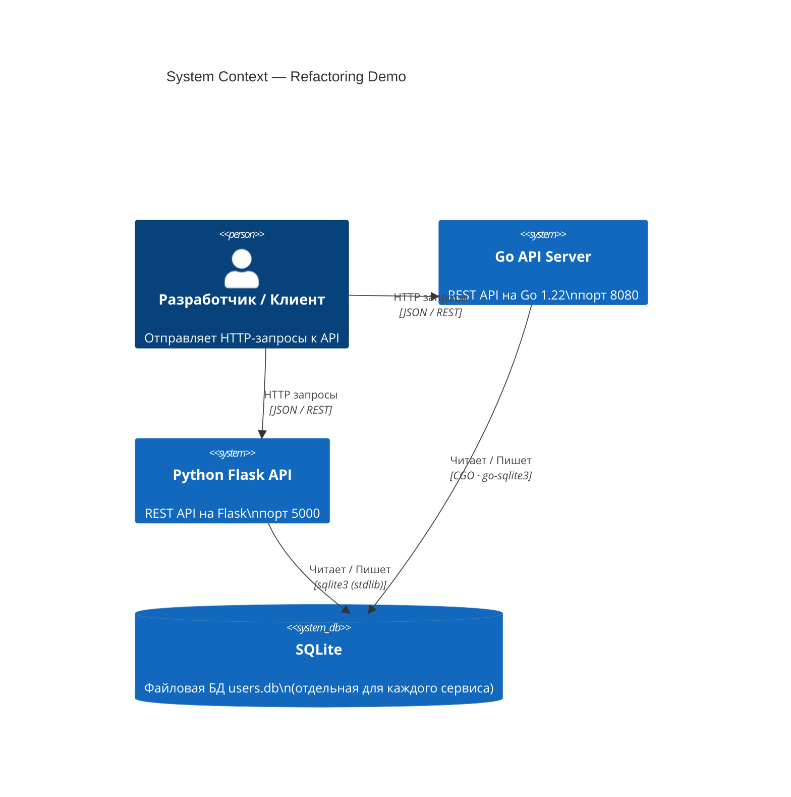
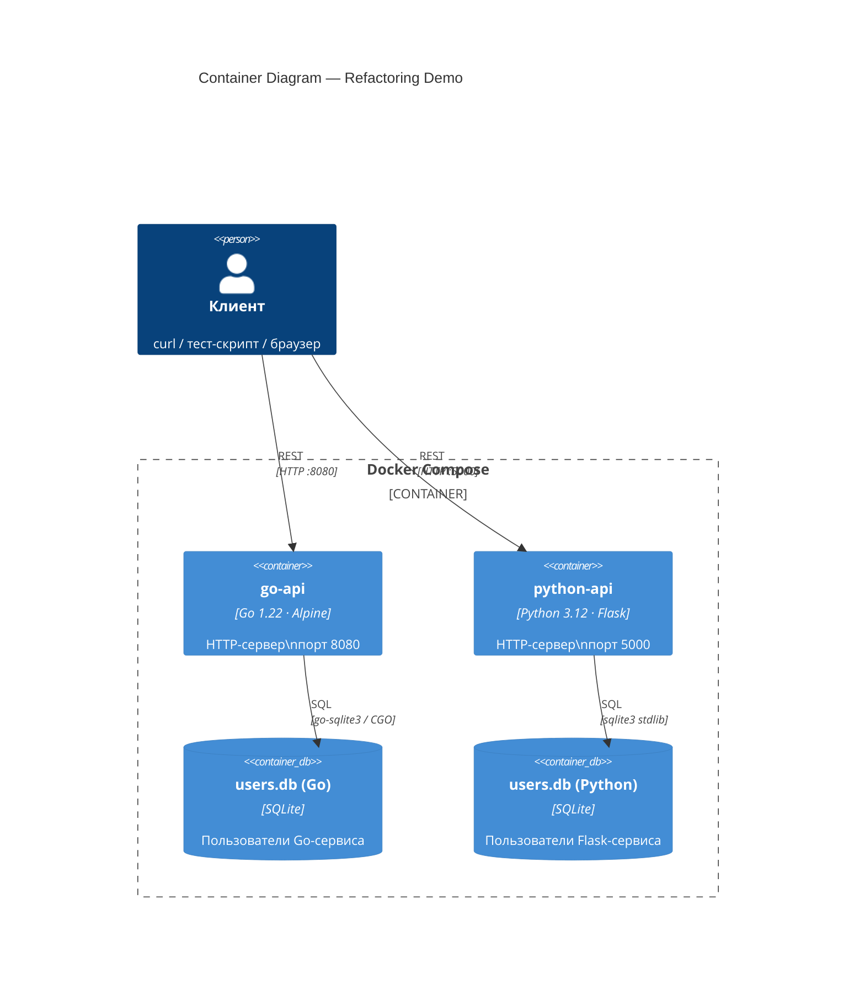
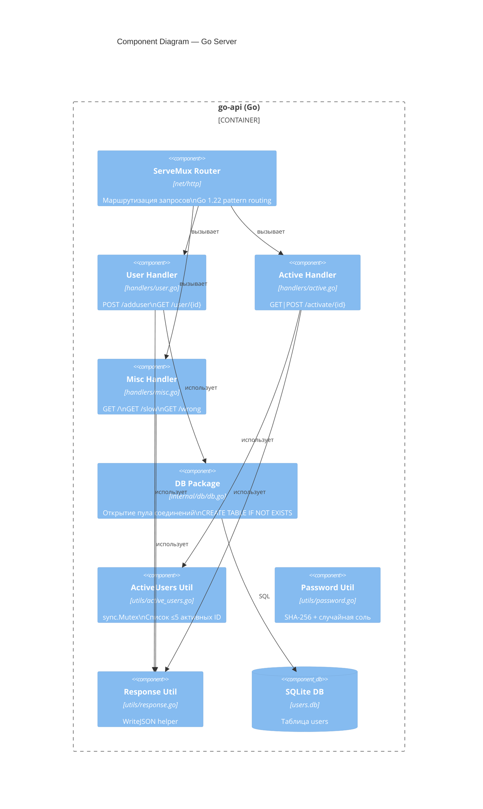
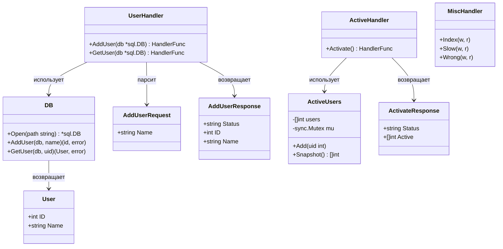
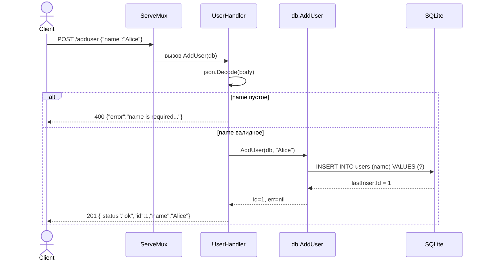
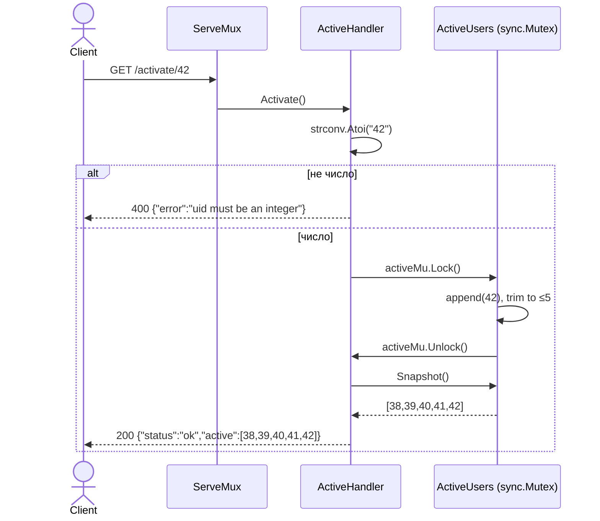
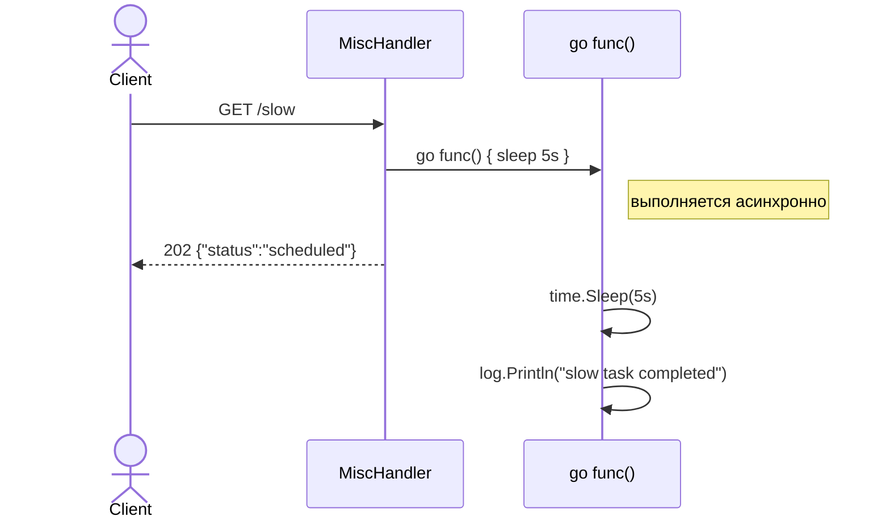
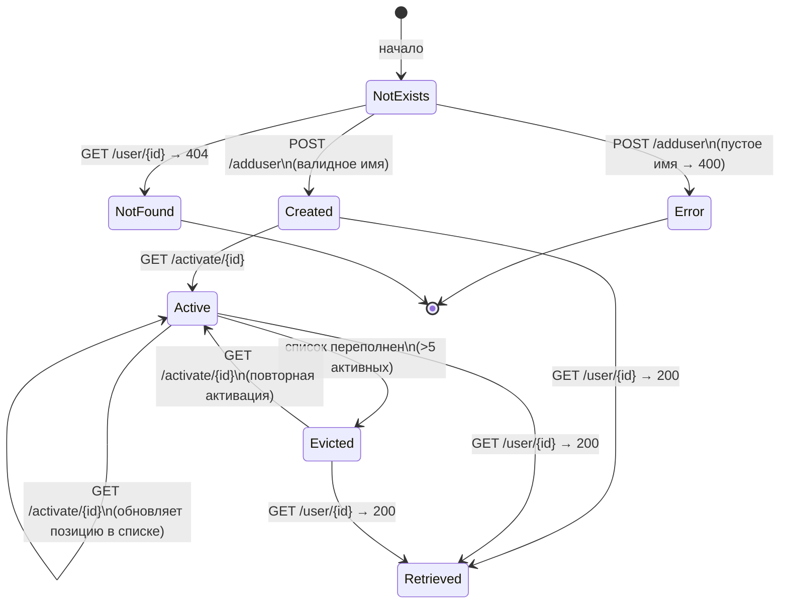
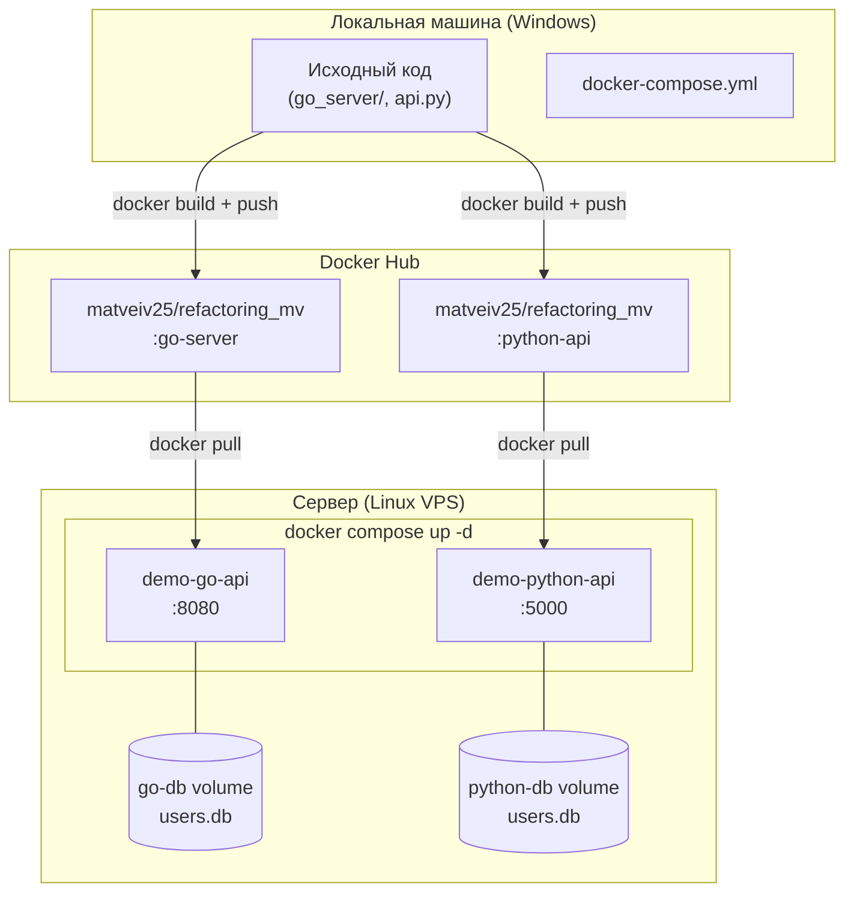

# Refactoring Demo Project

Учебный проект, демонстрирующий рефакторинг Python-кода: устранение SQL-инъекций, утечек соединений, гонок потоков и небезопасного хранения паролей. Параллельно реализован идентичный сервис на Go.

## Структура проекта

```
.
├── api.py                  # Flask REST API (Python)
├── utils.py                # Утилиты: БД, пароли, активные пользователи
├── requirements.txt        # Python-зависимости
├── openapi.yaml            # Спецификация OpenAPI 3.1
├── Dockerfile.python       # Docker-образ для Flask
├── docker-compose.yml      # Запуск обоих серверов одной командой
├── test_endpoints.py       # Python-скрипт проверки эндпоинтов
├── test_endpoints.sh       # Bash-скрипт (Linux/macOS)
├── test_endpoints.ps1      # PowerShell-скрипт (Windows)
├── go_server/              # Go-реализация того же API
│   ├── main.go
│   ├── Dockerfile
│   ├── go.mod
│   └── internal/
│       ├── db/             # Инициализация SQLite
│       ├── handlers/       # HTTP-хендлеры
│       ├── models/         # Структуры данных
│       └── utils/          # Утилиты (пароли, активные пользователи, JSON)
├── DEPLOY.md               # Гайд: Docker Hub → сервер
├── SERVER_SETUP.md         # Гайд: подключение к серверу и запуск
└── README.md
```

---

## Архитектура

### C4 Level 1 — System Context



### C4 Level 2 — Container Diagram



### C4 Level 3 — Component Diagram (Go Server)



---

## UML-диаграммы

### Диаграмма классов / структур



### Sequence Diagram — POST /adduser



### Sequence Diagram — GET /activate/{id}



### Sequence Diagram — GET /slow



### State Diagram — жизненный цикл пользователя



### Deployment Diagram



---

## Запуск через Docker (рекомендуется)

### Требования

- [Docker](https://docs.docker.com/get-docker/) 24+
- [Docker Compose](https://docs.docker.com/compose/) v2+

### Запустить оба сервера

```bash
docker compose up --build
```

- Flask API → `http://localhost:5000`
- Go API → `http://localhost:8080`

### Запустить один сервер

```bash
docker compose up --build go-api      # только Go
docker compose up --build python-api  # только Flask
```

### Остановить

```bash
docker compose down
```

---

## Запуск без Docker

### Python / Flask

```bash
pip install -r requirements.txt
python api.py
# → http://127.0.0.1:5000
```

### Go

```bash
cd go_server
go mod tidy
go run main.go
# → http://localhost:8080
```

---

## Проверка эндпоинтов

```bash
# Go-сервер :8080
python test_endpoints.py

# Flask-сервер :5000
python test_endpoints.py --port 5000

# Оба сервера
python test_endpoints.py --both
```

```powershell
# Windows PowerShell
.\test_endpoints.ps1           # Go :8080
.\test_endpoints.ps1 -Port 5000  # Flask :5000
```

---

## Эндпоинты API

| Метод | URL | Описание | Ответ |
|-------|-----|----------|-------|
| `GET` | `/` | HTML-страница с описанием API | `200` |
| `POST` | `/adduser` | Создать пользователя `{"name":"Alice"}` | `201` / `400` |
| `GET` | `/user/{id}` | Получить пользователя по ID | `200` / `404` |
| `GET\|POST` | `/activate/{id}` | Активировать пользователя | `200` / `400` |
| `GET` | `/slow` | Запустить фоновую задачу (горутина/поток) | `202` |
| `GET` | `/wrong` | Демонстрация обработки ошибок | `500` |

---

## Безопасность

- SQL-запросы параметризованы — SQL-инъекции исключены.
- Пароли хранятся как `pbkdf2_hmac` SHA-256 с солью.
- Соединения с БД управляются через контекстные менеджеры / пул `*sql.DB`.
- Общие структуры данных защищены `threading.Lock` (Python) / `sync.Mutex` (Go).

---

## Docker Hub

Образы опубликованы: [hub.docker.com/r/matveiv25/refactoring_mv](https://hub.docker.com/r/matveiv25/refactoring_mv)

| Тег | Описание |
|-----|----------|
| `go-server` | Go 1.22 + Alpine (~10 МБ) |
| `python-api` | Python 3.12 + Flask |

---

## Документация

| Файл | Содержание |
|------|-----------|
| `openapi.yaml` | OpenAPI 3.1 спецификация всех эндпоинтов |
| `DEPLOY.md` | Полный гайд: Docker Hub → Linux-сервер |
| `SERVER_SETUP.md` | Подключение по SSH и запуск на сервере |
| `go_server/README.md` | Документация Go-сервиса |
| `go_server/GO_GUIDE.md` | Go для Python-разработчика |
